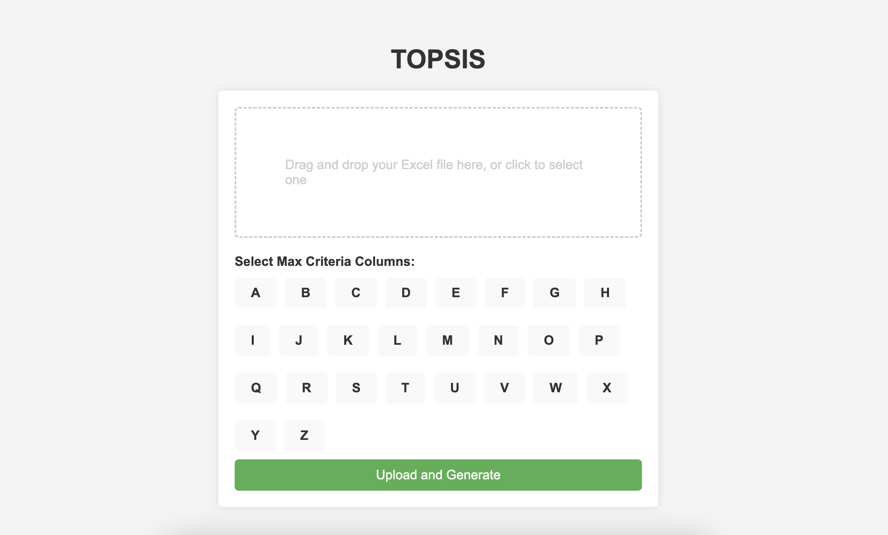

# TOPSIS Method Flask Project

## Description
This project implements the TOPSIS (Technique for Order of Preference by Similarity to Ideal Solution) method using a Flask web application. Users can upload excell data after tahn the program will generate topsis results using CRITIC Method which user will specify as excell columns.

## Installation
Install miniconda, after activating anaconda environment install the necessary packages in requirements.txt

### Prerequisites
- Latest stable Python version
 
## Features
- Upload datasets in Excell format
- Perform data cleaning and preprocessing
- Implement the TOPSIS method for multi-criteria decision analysis
- Download the results as an Excel file

## Contributing
Contributions are welcome! To contribute, follow these steps:

1. Fork the repository
2. Create your feature branch (`git checkout -b feature/AmazingFeature`)
3. Commit your changes (`git commit -m 'Add some AmazingFeature'`)
4. Push to the branch (`git push origin feature/AmazingFeature`)
5. Open a pull request

## License
Distributed under the MIT License. See `LICENSE` for more information.

